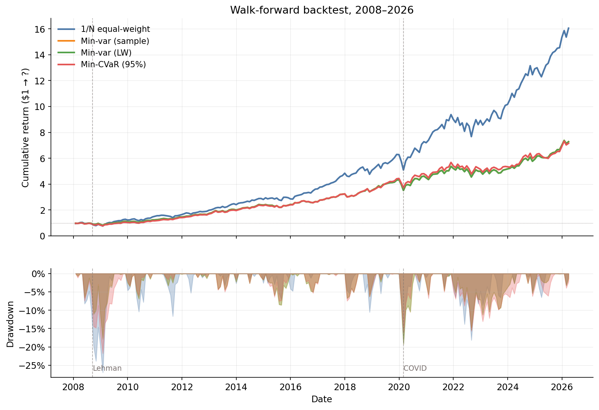
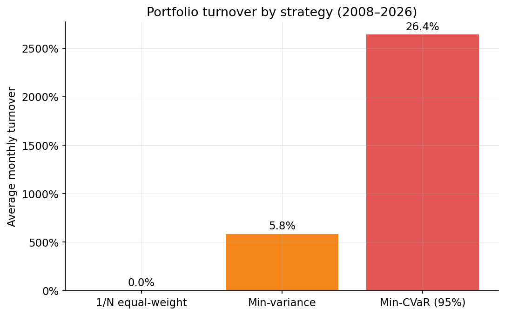
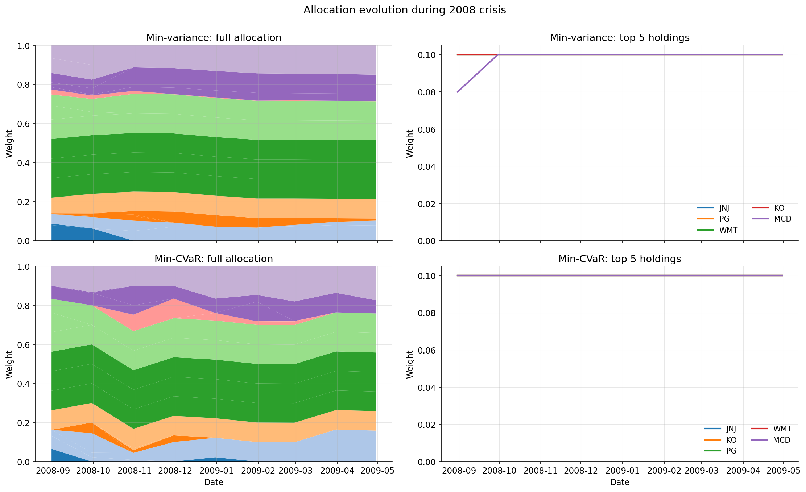
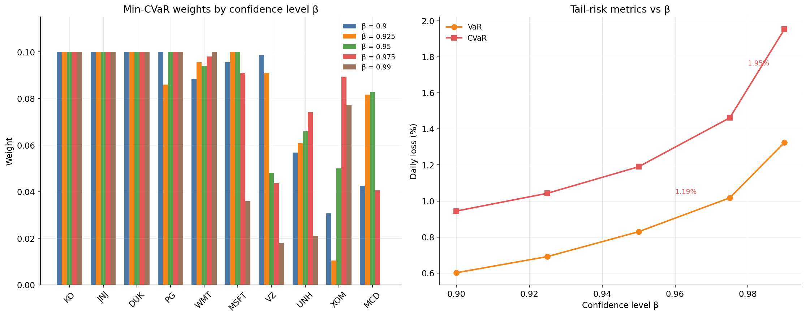

# Convex Portfolio Construction: Variance vs. Tail Risk
A personal project comparing two ways to build a stock portfolio: one that minimizes overall wobble (variance), and one that minimizes worst-case losses (CVaR). Walk-forward backtest on 30 large-cap U.S. stocks (2008–2026).

## Overview:
- I built two portfolio optimizers in Python using `cvxpy` — Markowitz mean-variance (quadratic program) and Rockafellar-Uryasev mean-CVaR (linear program).
- Tested both on 219 monthly rebalances against an equal-weight benchmark over 18 years.
- Equal-weight beat both optimizers on Sharpe ratio (1.11 vs 0.97 / 0.96); this follows the well known DeMiguel et al. (2009) finding.
- Min-variance and min-CVaR delivered nearly identical risk-adjusted returns, but min-CVaR rebalanced **4.5× more aggressively** (26% vs 6% monthly turnover) — meaning it would lose much more to trading costs in practice.

## What the optimizers do
**Min-variance** picks weights that make the portfolio's overall ups and downs as small as possible. It treats a 5% gain and a 5% loss as equally undesirable.

**Min-CVaR** picks weights that make the *average loss in the worst 5% of months* as small as possible. It only cares about the left tail — the bad months.

Both are *convex programs*, which is just a guarantee that there's one best answer and the solver will find it quickly. Math:

**Min-variance (QP):**
$$\min_{w} \; w^\top \Sigma w \quad \text{s.t.} \quad \mathbf{1}^\top w = 1, \; 0 \le w_i \le 0.10$$

**Min-CVaR (LP, β=0.95):**
$$\min_{w, \alpha, u} \; \alpha + \frac{1}{0.05 \cdot S} \sum_{s=1}^{S} u_s \quad \text{s.t.} \quad u_s \ge -r_s^\top w - \alpha, \; u_s \ge 0$$

## Setup
- **Universe:** 30 U.S. large-caps, ~3 per GICS sector, daily prices from `yfinance`.
- **Backtest:** monthly rebalance, 36-month rolling estimation window, 219 rebalances from 2008-01 to 2026-04.
- **Constraints:** long-only, fully invested, max 10% per asset.
- **CVaR scenarios:** 2,000 bootstrap samples per rebalance, 95% confidence level.

## Headline results

| Strategy | Return | Vol | Sharpe | Max DD | CVaR95 | Turnover |
|---|---|---|---|---|---|---|
| 1/N equal-weight | 16.43% | 14.81% | 1.11 | -26.99% | 8.35% | — |
| Min-variance (sample) | 11.49% | 11.89% | 0.97 | -19.24% | 7.37% | 5.83% |
| Min-variance (Ledoit-Wolf) | 11.49% | 11.90% | 0.97 | -19.21% | 7.38% | 5.76% |
| Min-CVaR (95%) | 11.39% | 11.90% | 0.96 | -21.75% | 7.35% | 26.40% |

The optimizers do exactly what they're designed to do — cut volatility and drawdowns by ~30% versus equal-weight. They just don't deliver enough return to compensate. Equal-weight wins because diversification across 30 names is itself a powerful (and parameter-free) form of risk control.

## Why min-CVaR underperforms

Min-CVaR's bootstrap scenarios change every month, so the optimizer keeps chasing whichever stocks happened to look "safe" in the most recent window. Min-variance only updates its covariance matrix, which is much more stable. The 4.5× turnover gap is the cost of optimizing on a noisier objective.

## Crisis periods

Both optimizers pile into the same defensive top 5 (JNJ, KO, PG, WMT, MCD) at the 10% cap during 2008. The differences show up in the rest of the book. During COVID (Feb–Apr 2020), min-CVaR was the **only** strategy that finished positive (+2.75%), suggesting bootstrap scenarios picked up the early COVID signal faster than rolling covariance did.

## β-sensitivity check

Tested β values from 0.90 to 0.99. Weights rotate (VZ shrinks, MCD grows) but every metric stays in the same ballpark.

## What I learned
The most surprising thing wasn't that the optimizers lost, it was just how much of their underperformance comes from estimation noise rather than from anything fundamental about the math behind them. Min-variance and min-CVaR are both correct in theory; they just inherit the bias and variance of whatever you feed them. Building the walk-forward harness made this concrete in a way that no textbook had: a model that looks sharp in-sample can deteriorate severely out-of-sample, and the only way to know is to test it that way.

## Limitations
- **Survivorship bias.** All 30 stocks survived to 2026. A real-time investable universe would include casualties (Lehman, GE pre-split, etc.) and Sharpe ratios would drop.
- **No transaction costs.** Min-CVaR's 26% turnover would be significantly more punishing in practice.
- **Bootstrap scenarios.** assume returns are independent across time, which they aren't (volatility clusters).
- **Sample period bias.** 2008–2026 contains two crises and a long bull run; results aren't guaranteed to generalize.

## Future extensions
**Tail dependence via copulas** — the bootstrap scenarios assume the joint distribution of returns is captured by historical co-movement, but during crises stocks crash together very often (more often than a normal correlation would predict). Therefore, fitting a t-copula to the marginals would let the scenario generator produce realistic joint left-tail events instead of relying on whether the historical sample happened to contain them.

Other extensions: GARCH-filtered scenarios for time-varying volatility, parametric tail fitting, and a larger universe where Ledoit-Wolf shrinkage actually matters (here it was nearly identical to sample covariance because N≪T).
